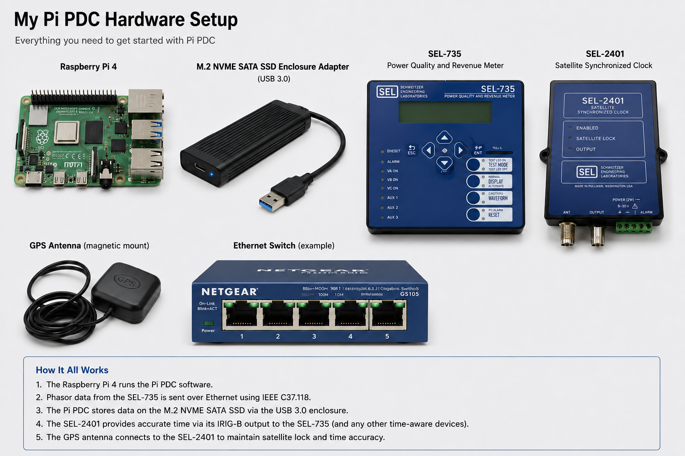

# Pi PDC

**Pi PDC** is a lightweight Python phasor data collector (concentrator) for Raspberry Pi, Windows, and other systems running Python 3.9 or newer.

It records IEEE C37.118 synchrophasor streams and SEL Fast Message data in an SQLite database. During steady-state conditions it stores periodic heartbeat records; during disturbances it records every sample, including configurable pre-trigger and post-trigger data.

## Features

- Standard-library Python only
- Runs on Windows and Raspberry Pi/Linux
- IEEE C37.118 support
- SEL Fast Message support for the SEL-734
- SQLite database
- Event-based deadband recording
- Optional full-rate recording
- Simulators for testing without hardware
- Tested with SEL-734, SEL-735, and SEL-351A devices

## Getting Started

1. Install Python 3.9 or newer.
2. Download or clone this repository.
3. Edit `config.ini`.
4. Run:

```bash
python collector.py
```

On Raspberry Pi/Linux:

```bash
python3 collector.py
```

The included simulators allow the collector to be tested without a physical PMU.

## Documentation

Complete setup instructions, operating notes, and design information are available at:

https://relayman.org/pdc/pipdc.html

## Main Files

| File | Purpose |
|---|---|
| `collector.py` | Main Pi PDC program |
| `config.ini` | Device, recording, path, and backup settings |
| `c37118.py` | IEEE C37.118 client and frame parser |
| `sel_fastmsg.py` | SEL Fast Message client |
| `deadband.py` | Deadband recording logic |
| `dbwriter.py` | SQLite database writer |
| `backup.py` | Database snapshot and cloud backup |
| `prune_old.py` | Prune data older than input date | 
| `status.py` | Health and status reporting |
| `sim_pmu.py` | IEEE C37.118 PMU simulator |
| `sim_734.py` | SEL-734 Fast Message simulator |

## Project Status


---

## Example Hardware Setup

I developed Pi PDC using a very simple hardware configuration consisting of a Raspberry Pi 4, an external USB SSD, an SEL-735 Power Quality Meter, an SEL-2401 Satellite Clock, an inexpensive GPS antenna, and a small Ethernet switch. My initial motivation was to simply track voltage outages so I focused on data compression (only save data if it is changeing by more than some percentage of nominal). I have since added the option to capture every PMU sample.  The SEL-734 can stream at 20 Hz, the SEL-351A and SEL-735 at 60 Hz.  The SEL-735 also streams rate-of-change-of-frequency (ROCOF) data along with the frequency which is nice. This Pi PDC by no means requires an SEL PMU, any compliant PMU will work. A lot of SEL gear is available on Ebay for decent prices from time-to-time.   



The Raspberry Pi runs the Pi PDC software and stores data on the external SSD. The SEL-735 streams synchrophasor data to the Pi using IEEE C37.118. The SEL-2401 provides GPS-disciplined time synchronization, and the GPS antenna can be an inexpensive one in my experience. A small Ethernet switch ties the components together. This inexpensive setup has proven to be reliable for long-term synchrophasor data collection.  Make sure to power all gear from a UPS if you want it to ride through an outage, and note that many PMUs will not stream when measured voltage is out of some range (e.g. less than 5% of nominal etc.).

**Beta**

This software is intended for monitoring, testing, research, and engineering applications. It has not been certified for protective relaying, revenue metering, grid control, or other safety-critical applications. Users are responsible for validating its suitability and accuracy for their application.
